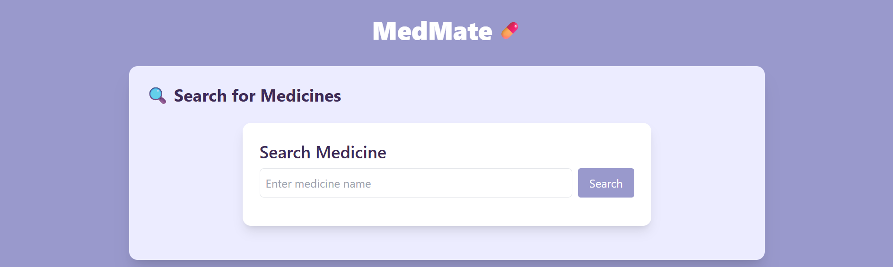
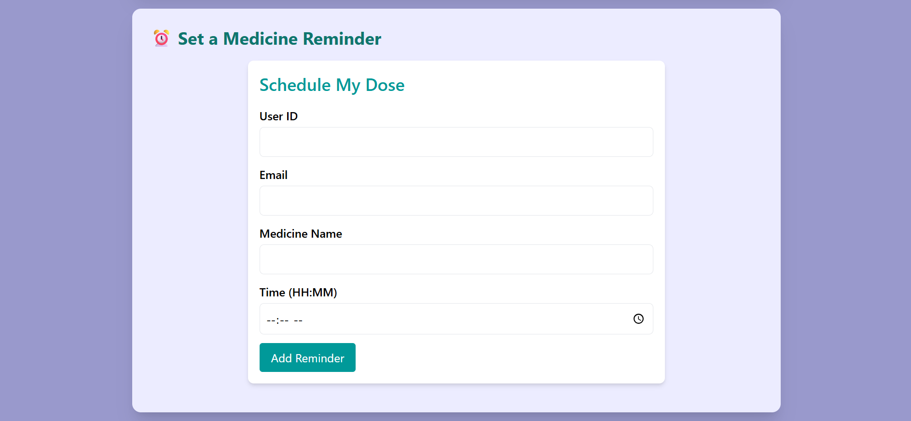
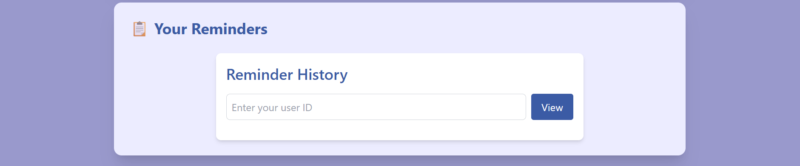

# 💊 MedMate

MedMate is a full-stack medicine management and reminder app that helps users:

- Search for nearby pharmacies stocking specific medicines
- Schedule daily medication reminders
- View scheduled doses in a simple, beautiful interface
- (Coming soon) Receive timely email alerts via scheduler

---

## 🖼️ Live Preview

 
 
 

---

## 🚀 Features

- 🔍 **Medicine Search**: Real-time search from local pharmacy database
- ⏰ **Reminders**: Add daily reminders with time and user ID
- 📜 **History**: View past reminders with frontend notifications
- 📬 **Email Integration** *(planned)*: Send reminder copies via email
- 🎨 **Modern UI**: Built using React + TailwindCSS with smooth interactions

---

## 🛠️ Tech Stack

| Frontend        | Backend       | Database    | Other             |
|-----------------|---------------|-------------|-------------------|
| React           | FastAPI       | PostgreSQL  | Axios, Toastify   |
| Tailwind CSS    | REST APIs     | SQLAlchemy  | APScheduler       |

---

## 📁 Folder Structure

```
MedMate/
│
├── Backend/ # FastAPI backend
│ ├── main.py # Main entry point
│ ├── scheduler.py # Background job runner (ping/email)
│ ├── config.py # Future config values (SMTP, env)
│ ├── crud.py # DB utility functions (CRUD ops)
│ ├── database.py # DB connection setup (SQLAlchemy)
│ ├── email_utils.py # Email sending functions (planned for future)
│ ├── models.py # SQLAlchemy models (Medicine, Reminder)
│ ├── schemas.py # Pydantic schemas for validation
│ └── routers/
│ ├── meds.py # /medicines/ API route
│ └── reminders.py # /reminders/ API route
│
├── medmate-frontend/ # React frontend
│ ├── public/ # Static files
│ ├── src/
│ │ ├── App.js # Main app component
│ │ ├── App.css # Styling overrides
│ │ ├── index.js # React entry point
│ │ ├── index.css # Global Tailwind + custom styles
│ │ ├── components/
│ │ │ ├── MedicineSearch.jsx # Medicine search component
│ │ │ ├── ReminderForm.jsx # Reminder input component
│ │ │ └── ReminderList.jsx # Reminder history + toast notifications
│ ├── tailwind.config.js # Tailwind CSS config
│ ├── postcss.config.js # PostCSS processor
│ ├── package.json # Frontend dependencies
├── Readme.md
```
---

## ⚙️ How to Run

### 🧪 Backend (FastAPI + PostgreSQL)

```bash
cd Backend
python -m venv venv
venv\Scripts\activate  # On Windows
pip install -r requirements.txt
uvicorn main:app --reload
🔁 Make sure PostgreSQL is running and connected (adjust config if needed)
```
---
### 🖥️ Frontend (React + TailwindCSS)
```bash
cd medmate-frontend
npm install
npm start
App will run on http://localhost:3000 by default.
```
### 🧪 3. Sample API Requests
Add sample requests for testing your backend manually via Postman or Swagger UI.
#### 🔌 Sample API Endpoints

##### ➕ Add Reminder

```http
POST /reminders/
Content-Type: application/json

{
  "user_id": "john123",
  "medicine_name": "Paracetamol",
  "time": "08:30"
}
```
#### 📋 Get Reminders
```http
GET /reminders/?user_id=john123
```
🔍 Search for Medicines
```http
GET /medicines/?name=paracetamol
```
---

### 🔒 4. **Planned Auth + Deployment Ideas**

```markdown
- 👤 User Authentication (JWT / Google OAuth)
- 📱 Mobile-first UI support
- 🚀 Deployment on:
  - Frontend: Vercel
  - Backend: Render
  - Database: Supabase or Railway PostgreSQL
```
---
### 📌 Upcoming Features
- 📧 Email reminders via SMTP integration
- 🧠 AI-powered medicine suggestions (future)
- 🏥 Location-based pharmacy mapping


